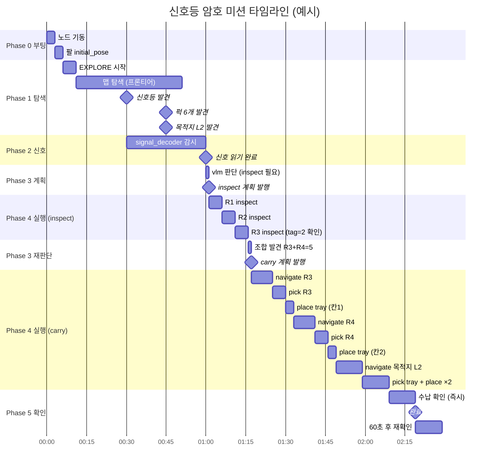
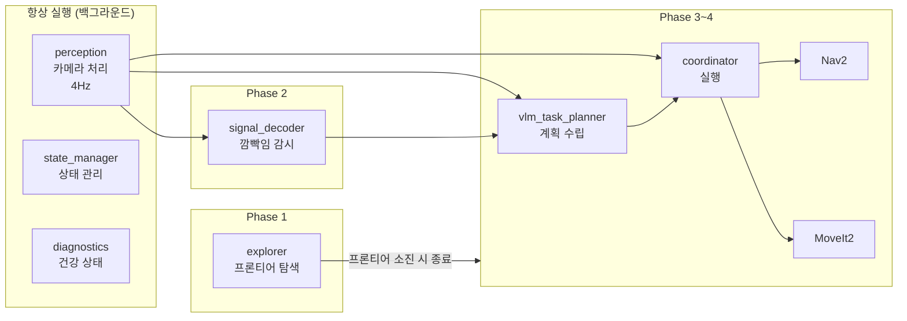

# 타임라인 예시

> 예시: 빨간 퍽 2개, 번호 합 5, 목적지 L2(tag=13)
> R3(tag=2) + R4(tag=3) = 5

## 전체 타임라인

```mermaid
gantt
    title 신호등 암호 미션 타임라인 (예시)
    dateFormat  mm:ss
    axisFormat  %M:%S

    section Phase 0 부팅
    노드 기동              :p0a, 00:00, 3s
    팔 initial_pose        :p0b, after p0a, 3s

    section Phase 1 탐색
    EXPLORE 시작           :p1a, after p0b, 5s
    맵 탐색 (프론티어)     :p1b, after p1a, 40s
    신호등 발견            :milestone, p1c, 00:30, 0s
    퍽 6개 발견            :milestone, p1d, 00:45, 0s
    목적지 L2 발견         :milestone, p1e, 00:45, 0s

    section Phase 2 신호
    signal_decoder 감시    :p2a, 00:30, 30s
    신호 읽기 완료         :milestone, p2b, 01:00, 0s

    section Phase 3 계획
    vlm 판단 (inspect 필요):p3a, 01:00, 1s
    inspect 계획 발행      :milestone, p3b, 01:01, 0s

    section Phase 4 실행 (inspect)
    R1 inspect             :p4a, 01:01, 5s
    R2 inspect             :p4b, after p4a, 5s
    R3 inspect (tag=2 확인):p4c, after p4b, 5s

    section Phase 3 재판단
    조합 발견 R3+R4=5      :p3c, after p4c, 1s
    carry 계획 발행        :milestone, p3d, after p3c, 0s

    section Phase 4 실행 (carry)
    navigate R3            :p4d, after p3d, 8s
    pick R3                :p4e, after p4d, 5s
    place tray (칸1)       :p4f, after p4e, 3s
    navigate R4            :p4g, after p4f, 8s
    pick R4                :p4h, after p4g, 5s
    place tray (칸2)       :p4i, after p4h, 3s
    navigate 목적지 L2     :p4j, after p4i, 10s
    pick tray + place ×2   :p4k, after p4j, 10s

    section Phase 5 확인
    수납 확인 (즉시)       :p5a, after p4k, 10s
    완료                   :milestone, p5b, after p5a, 0s
    60초 후 재확인         :p5c, after p5b, 10s
```

## 노드 동시 실행 구조

```mermaid
flowchart LR
    subgraph ALWAYS["항상 실행 (백그라운드)"]
        PE["perception\n카메라 처리\n4Hz"]
        SM["state_manager\n상태 관리"]
        DG["diagnostics\n건강 상태"]
    end

    subgraph PHASE1["Phase 1"]
        EX["explorer\n프론티어 탐색"]
    end

    subgraph PHASE2["Phase 2"]
        SD["signal_decoder\n깜빡임 감시"]
    end

    subgraph PHASE34["Phase 3~4"]
        VLM["vlm_task_planner\n계획 수립"]
        CO["coordinator\n실행"]
        N2["Nav2"]
        MV["MoveIt2"]
    end

    PE --> SD & VLM & CO
    EX --> |"프론티어 소진 시 종료"| PHASE34
    SD --> VLM
    VLM --> CO
    CO --> N2 & MV
```
